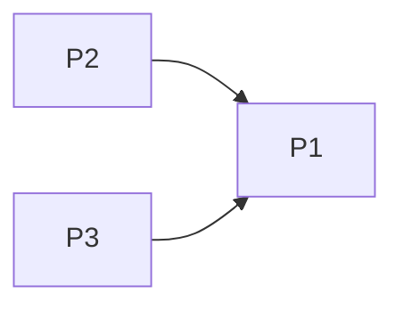

# Projects and dependencies analysis

This document provides a comprehensive overview of the projects and their dependencies in the context of upgrading to .NETCoreApp,Version=v10.0.

## Table of Contents

- [Executive Summary](#executive-Summary)
  - [Highlevel Metrics](#highlevel-metrics)
  - [Projects Compatibility](#projects-compatibility)
  - [Package Compatibility](#package-compatibility)
  - [API Compatibility](#api-compatibility)
- [Aggregate NuGet packages details](#aggregate-nuget-packages-details)
- [Top API Migration Challenges](#top-api-migration-challenges)
  - [Technologies and Features](#technologies-and-features)
  - [Most Frequent API Issues](#most-frequent-api-issues)
- [Projects Relationship Graph](#projects-relationship-graph)
- [Project Details](#project-details)

  - [PointsPerGame.Core/PointsPerGame.Core.csproj](#pointspergamecorepointspergamecorecsproj)
  - [PointsPerGame.UnitTests/PointsPerGame.UnitTests.csproj](#pointspergameunittestspointspergameunittestscsproj)

## Executive Summary

### Highlevel Metrics

| Metric | Count | Status |
| :--- | :---: | :--- |
| Total Projects | 3 | All require upgrade |
| Total NuGet Packages | 23 | 14 need upgrade |
| Total Code Files | 16 |  |
| Total Code Files with Incidents | 2 |  |
| Total Lines of Code | 36 |  |
| Total Number of Issues | 26 |  |
| Estimated LOC to modify | 0+ | at least 0.0% of codebase |

### Projects Compatibility

| Project | Target Framework | Difficulty | Package Issues | API Issues | Est. LOC Impact | Description |
| :--- | :---: | :---: | :---: | :---: | :---: | :--- |
| [PointsPerGame.Core/PointsPerGame.Core.csproj](#pointspergamecorepointspergamecorecsproj) | net48 | 🟢 Low | 20 | 0 |  | ClassicClassLibrary, Sdk Style = False |
| [PointsPerGame.UnitTests/PointsPerGame.UnitTests.csproj](#pointspergameunittestspointspergameunittestscsproj) | net48 | 🟢 Low | 2 | 0 |  | ClassicClassLibrary, Sdk Style = False |

### Package Compatibility

| Status | Count | Percentage |
| :--- | :---: | :---: |
| ✅ Compatible | 9 | 39.1% |
| ⚠️ Incompatible | 0 | 0.0% |
| 🔄 Upgrade Recommended | 14 | 60.9% |
| ***Total NuGet Packages*** | ***23*** | ***100%*** |

### API Compatibility

| Category | Count | Impact |
| :--- | :---: | :--- |
| 🔴 Binary Incompatible | 0 | High - Require code changes |
| 🟡 Source Incompatible | 0 | Medium - Needs re-compilation and potential conflicting API error fixing |
| 🔵 Behavioral change | 0 | Low - Behavioral changes that may require testing at runtime |
| ✅ Compatible | 12 |  |
| ***Total APIs Analyzed*** | ***12*** |  |

## Aggregate NuGet packages details

| Package | Current Version | Suggested Version | Projects | Description |
| :--- | :---: | :---: | :--- | :--- |
| FluentAssertions | 6.10.0 |  | [PointsPerGame.UnitTests.csproj](#pointspergameunittestspointspergameunittestscsproj) | ✅Compatible |
| HtmlAgilityPack | 1.11.46 |  | [PointsPerGame.Core.csproj](#pointspergamecorepointspergamecorecsproj) [PointsPerGame.UnitTests.csproj](#pointspergameunittestspointspergameunittestscsproj) | ✅Compatible |
| Microsoft.Bcl.AsyncInterfaces | 7.0.0 | 10.0.6 | [PointsPerGame.Core.csproj](#pointspergamecorepointspergamecorecsproj) | NuGet package upgrade is recommended |
| Microsoft.Extensions.DependencyInjection | 7.0.0 | 10.0.6 | [PointsPerGame.Core.csproj](#pointspergamecorepointspergamecorecsproj) | NuGet package upgrade is recommended |
| Microsoft.Extensions.DependencyInjection.Abstractions | 7.0.0 | 10.0.6 | [PointsPerGame.Core.csproj](#pointspergamecorepointspergamecorecsproj) | NuGet package upgrade is recommended |
| Microsoft.Extensions.Http | 7.0.0 | 10.0.6 | [PointsPerGame.Core.csproj](#pointspergamecorepointspergamecorecsproj) | NuGet package upgrade is recommended |
| Microsoft.Extensions.Logging | 7.0.0 | 10.0.6 | [PointsPerGame.Core.csproj](#pointspergamecorepointspergamecorecsproj) | NuGet package upgrade is recommended |
| Microsoft.Extensions.Logging.Abstractions | 7.0.0 | 10.0.6 | [PointsPerGame.Core.csproj](#pointspergamecorepointspergamecorecsproj) | NuGet package upgrade is recommended |
| Microsoft.Extensions.Options | 7.0.0 | 10.0.6 | [PointsPerGame.Core.csproj](#pointspergamecorepointspergamecorecsproj) | NuGet package upgrade is recommended |
| Microsoft.Extensions.Primitives | 7.0.0 | 10.0.6 | [PointsPerGame.Core.csproj](#pointspergamecorepointspergamecorecsproj) | NuGet package upgrade is recommended |
| NUnit | 3.13.3 |  | [PointsPerGame.UnitTests.csproj](#pointspergameunittestspointspergameunittestscsproj) | ✅Compatible |
| System.Buffers | 4.5.1 |  | [PointsPerGame.Core.csproj](#pointspergamecorepointspergamecorecsproj) | NuGet package functionality is included with framework reference |
| System.Configuration.ConfigurationManager | 7.0.0 | 10.0.6 | [PointsPerGame.Core.csproj](#pointspergamecorepointspergamecorecsproj) | NuGet package upgrade is recommended |
| System.Diagnostics.DiagnosticSource | 7.0.0 | 10.0.6 | [PointsPerGame.Core.csproj](#pointspergamecorepointspergamecorecsproj) | NuGet package upgrade is recommended |
| System.Memory | 4.5.5 |  | [PointsPerGame.Core.csproj](#pointspergamecorepointspergamecorecsproj) | NuGet package functionality is included with framework reference |
| System.Numerics.Vectors | 4.5.0 |  | [PointsPerGame.Core.csproj](#pointspergamecorepointspergamecorecsproj) | NuGet package functionality is included with framework reference |
| System.Runtime.Caching | 7.0.0 | 10.0.6 | [PointsPerGame.Core.csproj](#pointspergamecorepointspergamecorecsproj) | NuGet package upgrade is recommended |
| System.Runtime.CompilerServices.Unsafe | 6.0.0 | 6.1.2 | [PointsPerGame.Core.csproj](#pointspergamecorepointspergamecorecsproj) [PointsPerGame.UnitTests.csproj](#pointspergameunittestspointspergameunittestscsproj) | NuGet package upgrade is recommended |
| System.Security.AccessControl | 6.0.0 | 6.0.1 | [PointsPerGame.Core.csproj](#pointspergamecorepointspergamecorecsproj) | NuGet package upgrade is recommended |
| System.Security.Permissions | 7.0.0 | 10.0.6 | [PointsPerGame.Core.csproj](#pointspergamecorepointspergamecorecsproj) | NuGet package upgrade is recommended |
| System.Security.Principal.Windows | 5.0.0 |  | [PointsPerGame.Core.csproj](#pointspergamecorepointspergamecorecsproj) | NuGet package functionality is included with framework reference |
| System.Threading.Tasks.Extensions | 4.5.4 |  | [PointsPerGame.Core.csproj](#pointspergamecorepointspergamecorecsproj) [PointsPerGame.UnitTests.csproj](#pointspergameunittestspointspergameunittestscsproj) | NuGet package functionality is included with framework reference |
| System.ValueTuple | 4.5.0 |  | [PointsPerGame.Core.csproj](#pointspergamecorepointspergamecorecsproj) | NuGet package functionality is included with framework reference |

## Top API Migration Challenges

### Technologies and Features

| Technology | Issues | Percentage | Migration Path |
| :--- | :---: | :---: | :--- |

### Most Frequent API Issues

| API | Count | Percentage | Category |
| :--- | :---: | :---: | :--- |

## Projects Relationship Graph

Legend:
📦 SDK-style project
⚙️ Classic project

## Project Details

